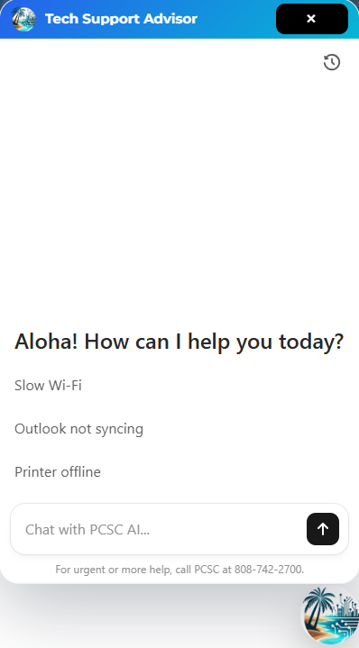
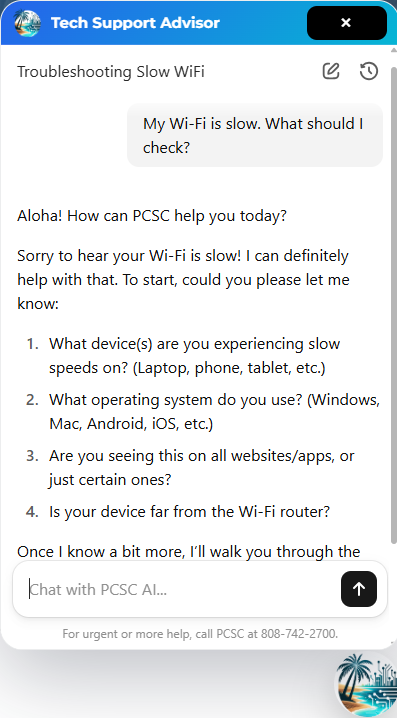

# AI Tech Support Chatbot for PCSC Website


---

AI-powered tech support chatbot integrated into the Poipu Computer Service and Consulting (PCSC) website using WordPress, PHP, JavaScript, CSS, and OpenAI ChatKit.

## Overview

This project integrates an AI-powered tech support chatbot into the Poipu Computer Service and Consulting (PCSC) website. It was built as a custom WordPress plugin using PHP, JavaScript, CSS, and OpenAI ChatKit to provide guided troubleshooting while controlling usage through secure session handling and rate limiting.

## Preview

<table align="center">
  <tr>
    <td align="center">
      <br>
      <sub><b>AI Tech Support Chatbot UI</b></sub>
    </td>
    <td width="30"></td>
    <td align="center">
      <br>
      <sub><b>AI Chatbot Response Example</b></sub>
    </td>
  </tr>
</table>

## Key Features

- AI-powered tech support for common IT issues
- Custom WordPress plugin integration
- Secure PHP backend for session token generation
- Branded chat widget built with JavaScript and CSS
- Mobile-responsive interface
- IP-based rate limiting and usage control
- Stable chat initialization and improved reliability

## Tech Stack

### Frontend


### Backend


### AI / API


### Other


## Architecture

```text
User (Browser)
   ↓
Custom JS Widget (Chat UI)
   ↓
Credit Check / Session Validation
   ↓
OpenAI ChatKit Session API
   ↓
AI Response Returned to Frontend
```
## How It Works

1. The user opens the chatbot from the floating launcher on the PCSC website.
2. The frontend widget requests a temporary client session from the WordPress backend.
3. The backend validates usage limits and generates a secure session token.
4. OpenAI ChatKit uses that session to connect the user with the AI agent workflow.
5. The chatbot responds with step-by-step troubleshooting guidance inside the branded chat interface.

## Challenges Solved

- Fixed chat UI initialization issues
- Resolved the issue where the header appeared only after scrolling
- Fixed stuck loading and connecting behavior caused by stale session handling
- Prevented session token reuse by generating fresh secure sessions
- Added IP-based rate limiting and server-side validation to control abuse and API cost
- Maintained custom branding while embedding the AI chat interface

## Project Structure

```text
PCSC-AI-Chatbot/
├── plugin/
│   ├── pcsc-tech-support-advisor.php
│   └── assets/
│       ├── chatkit-widget.css
│       |── chatkit-widget.js
        └── pcsc-logo.png
├── screenshots/
└── .gitignore
└── README.md
```

## Setup
To run this project in a real WordPress environment, you would need:
- a WordPress site
- the custom plugin files in the correct plugin directory
- frontend assets loaded correctly
- OpenAI API credentials configured securely outside the repository
- ChatKit workflow configuration defined in server-side settings

## Future Improvements

- Add user login support
- Build an admin dashboard to monitor usage
- Integrate CRM or ticketing workflow
- Add analytics for common issues and user behavior
- Support live human handoff when needed

## Notes

This repository is a portfolio-safe version of a real-world business project. Sensitive production data, credentials, private configuration details, and any confidential business information have been removed or replaced with placeholders before publication.
